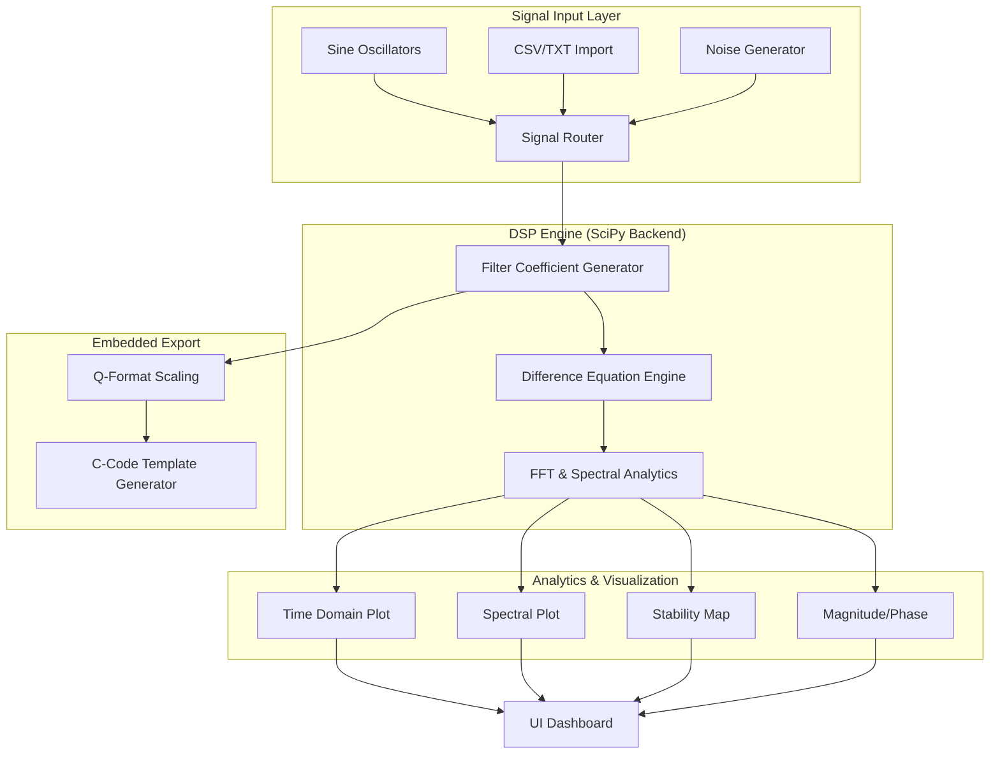

========
Designed by Mehdi sehati shal 
| version v1.0.0 
| date : 2026-02-03
========

# Advanced DSP Studio Pro - Documentation

## 1. Overview
Advanced DSP Studio Pro is an industrial-grade engineering workbench designed for real-time digital signal processing, filter analysis, and embedded firmware code generation. It bridges the gap between high-level filter theory and low-level C implementation.

---

## 2. Software Capabilities

###  Signal Generation & Input
*   **Real-time Synthesizer:** Dual independent oscillators with frequency and amplitude control + variable Gaussian noise.
*   **Universal Input:** Support for CSV and TXT data imports for analyzing real-world sensor logs.
*   **Dynamic Bandwidth:** Switchable hardware range (1kHz High-Precision or 10kHz Extended) with automatic Nyquist-locked Fs adjustment up to 20kHz.

###  Comprehensive Filter Engine
*   **IIR Models:** Butterworth, Chebyshev I & II, Elliptic (Cauer).
*   **FIR Windows:** Kaiser (with Beta control), Hamming, Hanning, Blackman, and Rectangular.
*   **Specialized Filters:** High-Speed Notch (with Q-factor control) and complex Band-Pass/Stop responses.
*   **Advanced Parameters:** Direct control over Order, Cutoff frequencies, Passband Ripple, and Stopband Attenuation.

###  Professional Analytics (Dashboard)
*   **Dual-View Optimization:** Toggle between "Architect Mode" (Detailed briefs) and "Cockpit Mode" (High-density grid).
*   **Seven Analytics Modules:**
    1.  **O-Scope:** Time-domain comparison of Raw vs. Filtered.
    2.  **FFT Spectrum:** Frequency content visualization.
    3.  **Magnitude (dB):** Logarithmic gain profile for stopband verification.
    4.  **Impulse Response:** Verification of ringing and settling time.
    5.  **Z-Plane Map:** Root-locus stability analysis (Pole/Zero placement).
    6.  **Phase Response:** Group delay and phase rotation analysis.
    7.  **Linear Gain:** Voltage-ratio multiplier profile.

### 💻 Embedded Architect Export
*   **Auto-Generated Documentation:** ASCII Transfer Function $H(z)$ and stability reports.
*   **Fixed-Point Conversion:** Automatic scaling for `Q1.15` (16-bit) and `Q16.16` (32-bit).
*   **C Implementation:** Direct Form II (memory-optimized) C functions ready for STM32, ESP32, or ARM CPUs.

---

## 3. System Architecture (Block Diagram)

---

## 4. Operational Guidelines

### Quick Start: Designing an IIR Filter
1.  **Set Range:** Choose "Extended Range (10kHz)" if working with high-speed signals.
2.  **Source:** Use 'Synth' to test theory; 'Import' to analyze real captured data.
3.  **Configure:** 
    *   Choose `IIR` -> `Butterworth` -> `Low-Pass`.
    *   Adjust `Cutoff 1` to target your noise frequency.
4.  **Verify:** Scroll down to the **Z-Plane Stability Map**. Ensure all `X` (poles) are inside the white circle.
5.  **Export:** Click **Calculate & Analyze**. Copy the generated `float Process(...)` function and the `B_Q15`/`A_Q15` coefficients into your C project.

### Stability Warning
If poles (red X) move outside the white unit circle in the Z-Plane map, the filter is **mathematically unstable**. This will cause an overflow/crash in your hardware implementation. Reduce the filter order or adjust the cutoff to bring the system back to stability.

---

## 5. Environment & Installation
The studio is powered by Python 3.10+ and requires the following industrial-scientific libraries:
*   `numpy`, `scipy`, `matplotlib`, `customtkinter`

**Easy Launch:** Double-click `run_studio.bat`. It will automatically verify your environment, install any missing libraries, and launch the application.

